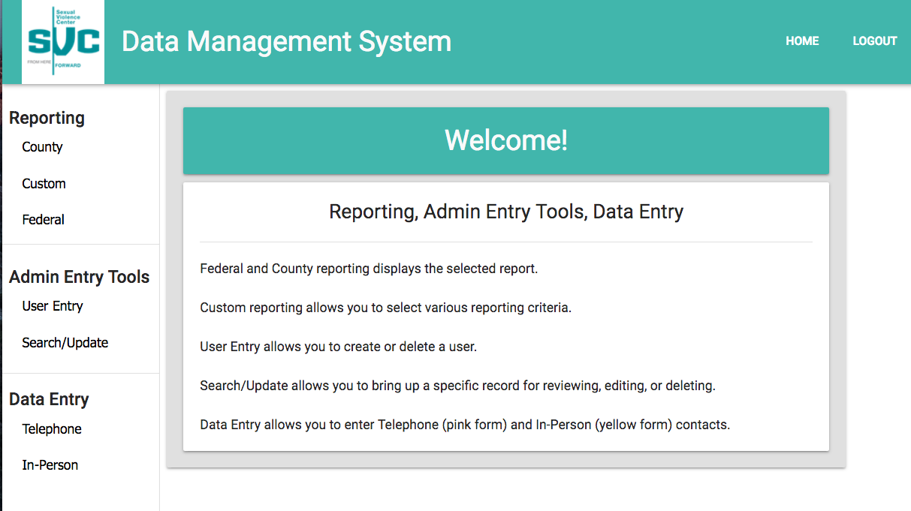
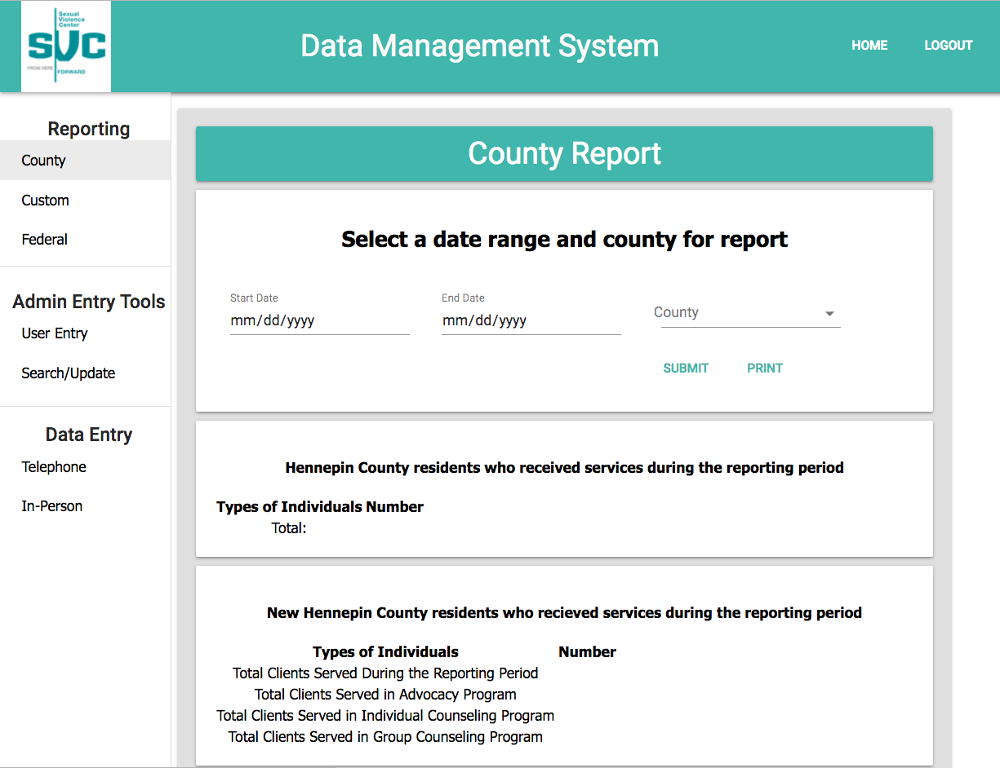
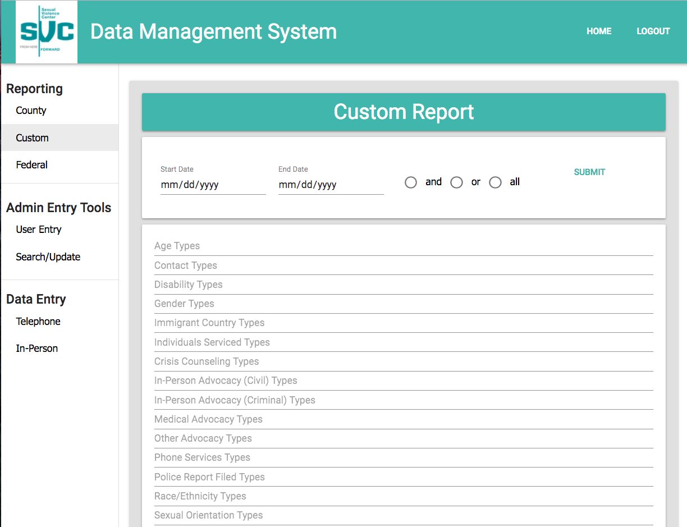
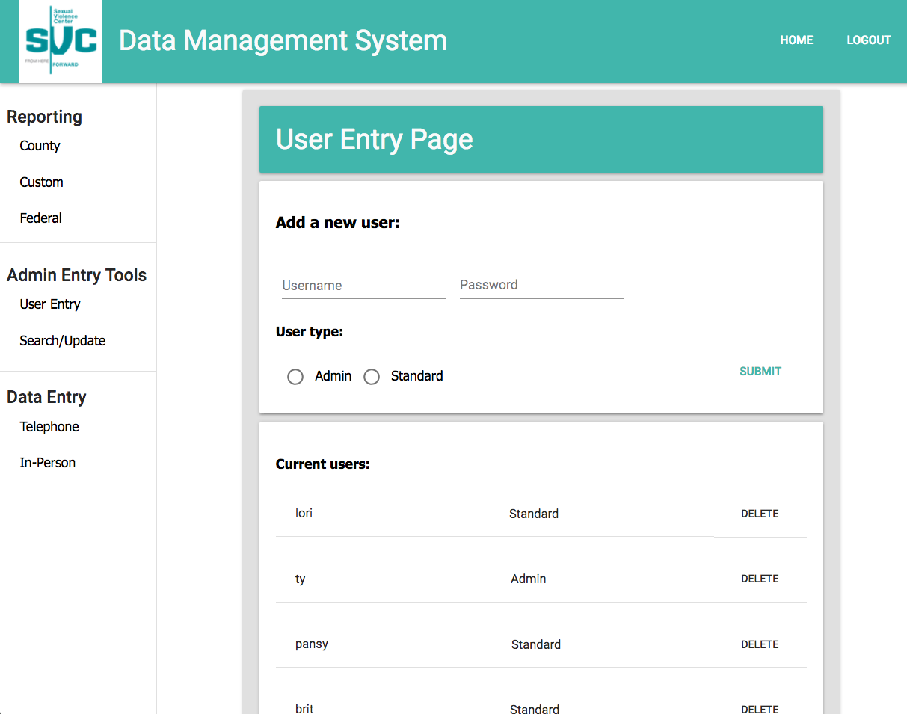
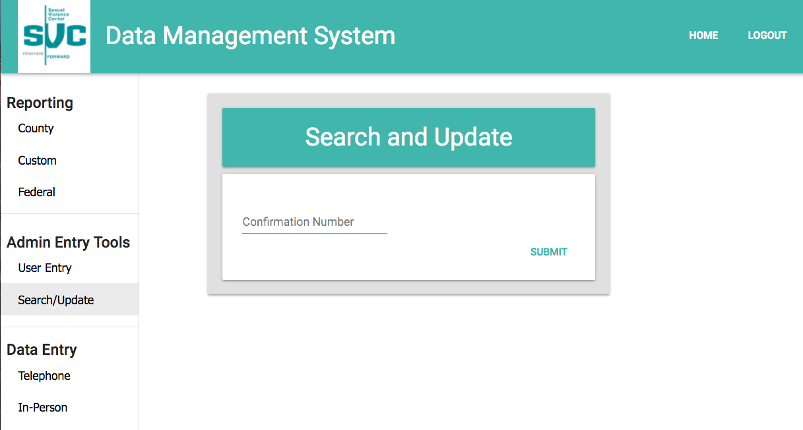

###READ ME

##Sexual Violence Center Data Management Tool
Blake Burbach, Brittany Marty, Sarah Bloomberg, Stephen Engler, and Ty Richardson

#Application Overview
The SVC Data Management Tool is a Single Page Application hosted on Heroku which runs in the browser. It facilitates entry of client interaction data, and it outputs reporting and statistical data for Sexual Violence Center. No personal identifying information is entered into or contained within the application. The data entry aligns with their current data collection forms. The reporting provides the specific data required for federal and county funding sources and flexible custom reporting capabilities to search various categories of data collected by SVC. There are two levels of access, Standard and Admin. All registration of users is controlled by Admins.

#Techology Used
React
Redux
Material-UI/Next
Node/Express
PostgreSQL
Heroku

#Views and Features
Upon login, Standard users and Admin users are presented different Landing Pages and Navigation bars. The navigation access allowed Standard users is a subset of the navigation access allowed Admin users. The Standard user's data entry views, Telephone and In-Person, are color-coded to match the color of the paper forms from which they are entering data.

Standard user examples:


Admin user examples:











#Database/SQL

db name = svc-data

CREATE TABLE person (
    id SERIAL PRIMARY KEY,
    username VARCHAR (80) UNIQUE NOT NULL,
    password VARCHAR (1000) NOT NULL,
    user_type BOOLEAN -- "admin" = true, "user" = false
);

CREATE TABLE victim (
	id SERIAL PRIMARY KEY,
--  SVC Advocacy Information
	date_entered DATE,
	advocate_name VARCHAR (255),
	contact_date DATE,
	
	start_time TIMETZ,
	end_time TIMETZ,
	
	service_location VARCHAR (255),
	service_county VARCHAR (255),
	in_person_client_number INTEGER,
	
--  Victim/Survivor Information
	victim_zipcode INTEGER,
	victim_type VARCHAR (255), -- drop down
	victim_referral_source VARCHAR (255),
	victim_prior_contact BOOLEAN,
	victim_contact_prior_oct BOOLEAN, --CHANGED FROM victim_prior_oct
	
--  In-Person Services Provided
	crisis_counseling_individual BOOLEAN,
	crisis_counseling_group BOOLEAN,
	legal_law_enforcement_interview BOOLEAN,
	legal_prosecution_related BOOLEAN,
	legal_court_advocacy BOOLEAN,
	legal_ofp_hro BOOLEAN,  
	legal_immigration BOOLEAN,
	legal_intervention BOOLEAN,
	
	medical_exam_support BOOLEAN,
	transportation_medical_exam_support BOOLEAN,
	medical_accompaniment_medical BOOLEAN,
	transportation_medical_accompaniment_medical BOOLEAN,
	medical_accompaniment_dental BOOLEAN,
	transportation_medical_accompaniment_dental BOOLEAN,
	
-- Other Services Provided
	crisis_counseling BOOLEAN,  
	information_referral BOOLEAN,
	information_criminal_justice BOOLEAN, 
	other_emergency_justice BOOLEAN,
	safe_at_home BOOLEAN,
	emergency_financial BOOLEAN,
	reparations_claims BOOLEAN,
	
	in_person_services_received_prior_oct BOOLEAN,
	
--  Unmet needs
	unmet_need_financial BOOLEAN,
	unmet_need_shelter_housing BOOLEAN,
	unmet_need_other BOOLEAN,  
	unmet_need_staying_where VARCHAR (255),
	unmet_other_descr VARCHAR (255),
	
-- Referral Services
	referral_svc VARCHAR (255),
	referral_agency VARCHAR (255),
	referral_other VARCHAR (255),
	
	supported_on_call VARCHAR (255), --drop down of yes, no, or unknown/hung up
	
	
--  Type of Sexual Violence
	violence_adult_sexual BOOLEAN, 
	
	violence_adult_when_child_by_family BOOLEAN, -- CHANGED FROM violence_adult_child_family
	violence_adult_when_child_by_other BOOLEAN, -- CHANGED FROM violence_adult_child_other
	
	violence_bullying BOOLEAN,
	violence_child_pornography BOOLEAN,
	violence_domestic BOOLEAN,
	violence_elder BOOLEAN,
	violence_exposing BOOLEAN,
	violence_internet BOOLEAN,
	
	violence_minor_by_family BOOLEAN, -- CHANGED FORM violence_minor_family
	violence_minor_by_other BOOLEAN, -- CHANGED FORM violence_minor_other
	
	violence_phone BOOLEAN,
	
	violence_exploitation_trafficking BOOLEAN,  -- CHANGED FROM violence_exploitation
	
	violence_harassment BOOLEAN,
	violence_stalking BOOLEAN,
	violence_teen_dating BOOLEAN,
	violence_other BOOLEAN,
	violence_other_specify VARCHAR (255),
	violence_unknown BOOLEAN,
	victim_multiple_types_violence BOOLEAN, -- CHANGED FROM victim_multiple
	
--  sice Report
 	police_report_filed VARCHAR (255),

--  Demographic Survery
	victim_age INTEGER,
	victim_gender VARCHAR (255),
	victim_transgender VARCHAR (255), --drop down of yes, no, or unknown/pass
	victim_sexual_orientation VARCHAR (255),
	victim_gender_pronouns VARCHAR (255),
	
--	Disability Status
	disability_blind BOOLEAN,
	disability_physical BOOLEAN,
	disability_mental BOOLEAN,
	disability_deaf BOOLEAN,
	disability_developmental BOOLEAN,
	disability_other BOOLEAN,
	disability_other_specify VARCHAR (255),
	disability_unknown BOOLEAN,
	disability_none BOOLEAN,
	
--  Ethnic background. Will be a drop down
	victim_ethnicity VARCHAR (255),
	victim_ethnicity_other_specify VARCHAR (255),
	
--  Immigrant Status. Will be a drop down
	victim_immigrant VARCHAR (255),
	victim_immigrant_other_specify VARCHAR (255),
	
--  Other
	homeless BOOLEAN,
	limited_english BOOLEAN,
	veteran BOOLEAN,
	
	victim_number VARCHAR (255),
	contact_type VARCHAR (255),
	form_number INTEGER
	
);

# Express/Passport with React
This version uses React to control the login requests and redirection in coordination with client-side routing.

## Prerequisites

Before you get started, make sure you have the following software installed on your computer:

- [Node.js](https://nodejs.org/en/)
- [PostrgeSQL](https://www.postgresql.org/)
- [Nodemon](https://nodemon.io/)

## Download (Don't Clone) This Repository

* Don't Fork or Clone. Instead, click the `Clone or Download` button and select `Download Zip`.
* Unzip the project and start with the code in that folder.
* Create a new GitHub project and push this code to the new repository.

## Development Setup Instructions

* Run `npm install`
* Create a `.env` file at the root of the project and paste this line into the file:
    ```
    SERVER_SESSION_SECRET=superDuperSecret
    ```
    While you're in your new `.env` file, take the time to replace `superDuperSecret` with some long random string like `25POUbVtx6RKVNWszd9ERB9Bb6` to keep your application secure. Here's a site that can help you: [https://passwordsgenerator.net/](https://passwordsgenerator.net/). If you don't do this step, create a secret with less than eight characters, or leave it as `superDuperSecret`, you will get a warning.

* Start postgres if not running already by using `brew services start postgresql`
* Run `npm run dev`
* Navigate to `localhost:3000`

## Linting

The Airbnb ESLint for react is a part of this project. If you would like to take advantage of this in VS Code, you can add the `ESLint` extension. Click the `Extensions` button (the button right below the `Debug`) and search for `ESLint`. Click `install` for the first result and then click `Reload`. Then it should be all set up!

## Production Build

This is the build Heroku will run, but during development, you will likely not need to use it.

* Start postgres if not running already by using `brew services start postgresql`
* Run `npm start`
* Navigate to `localhost:5000`

## Lay of the Land

* `src/` contains the React application
* `public/` contains static assets for the client-side
* `build/` after you build the project, contains the transpiled code from `src/` and `public/` that will be viewed on the production site
* `server/` contains the Express App

## Deployment

1. Create a new Heroku project
2. Link the Heroku project to the project GitHub Repo
3. Create an Herkoku Postgres database
4. Connect to the Heroku Postgres database from Postico
5. Create the necessary tables
6. Add an environment variable for `SERVER_SESSION_SECRET` with a nice random string for security
7. In the deploy section, select manual deploy
